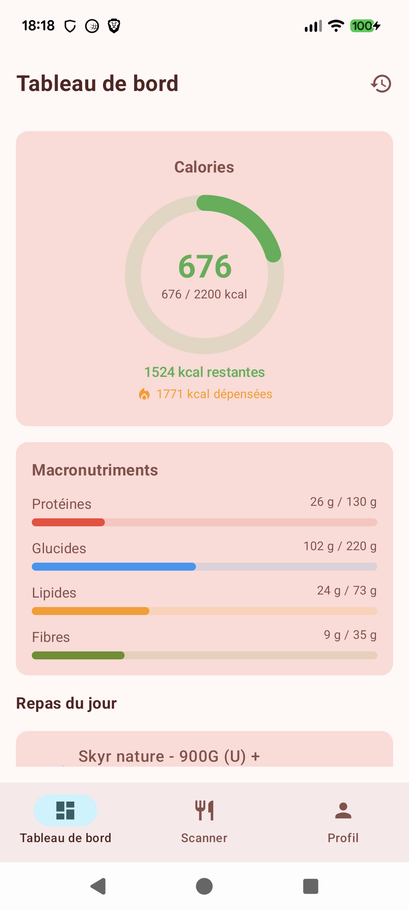
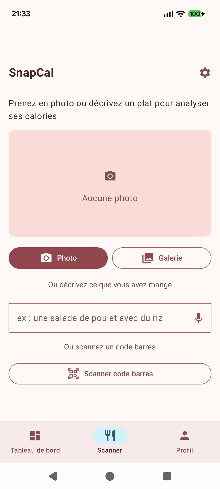
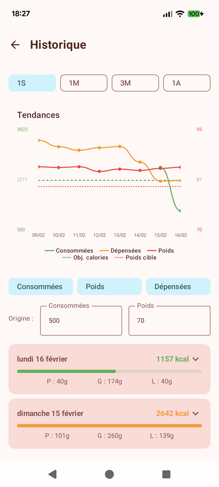
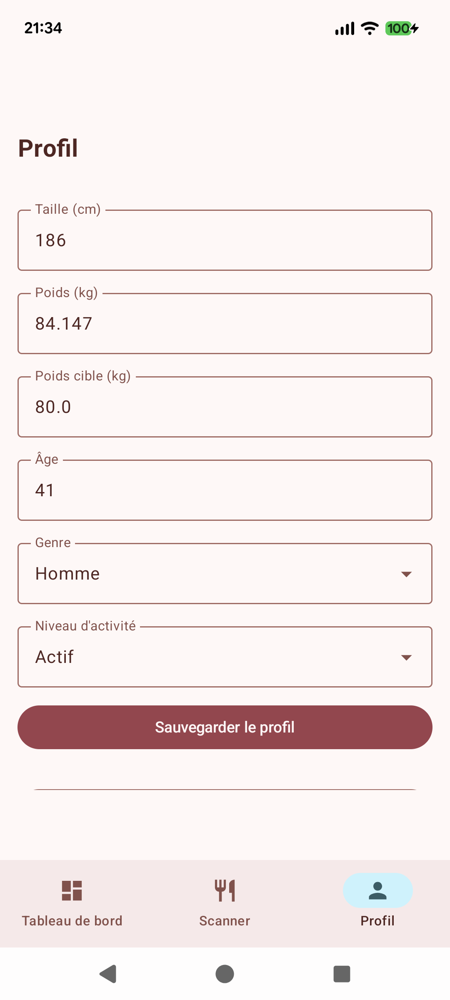
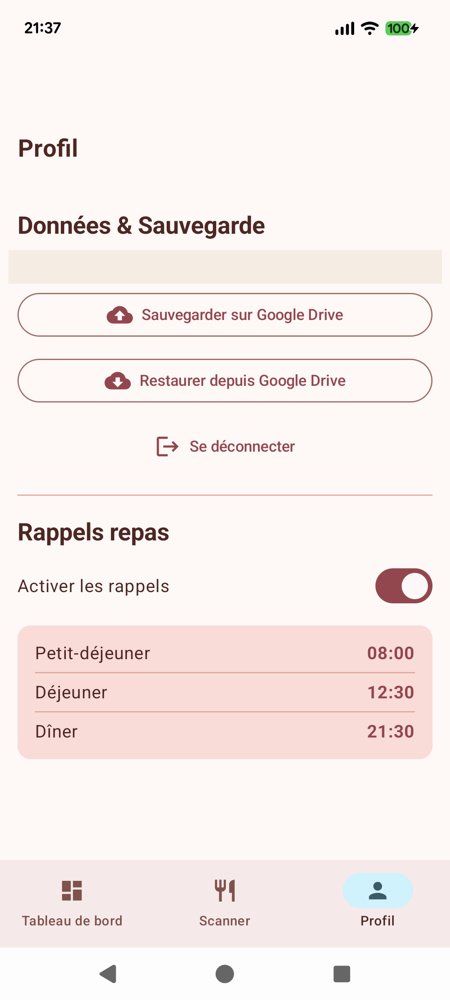
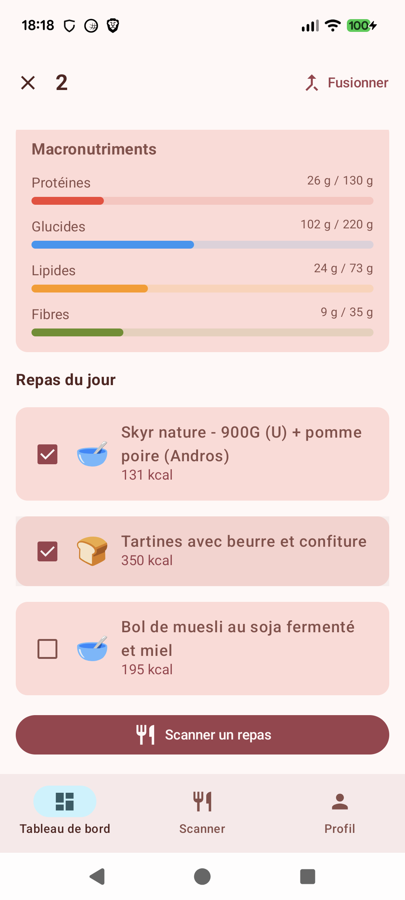
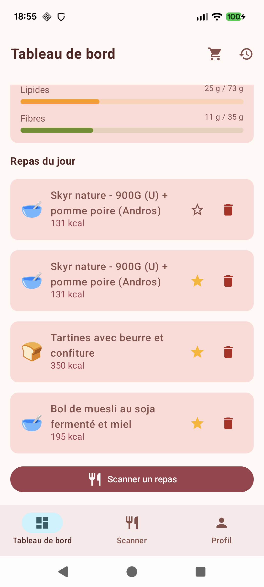
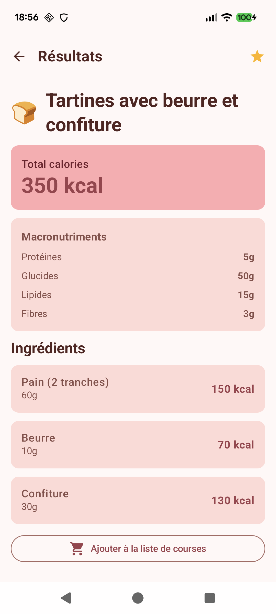
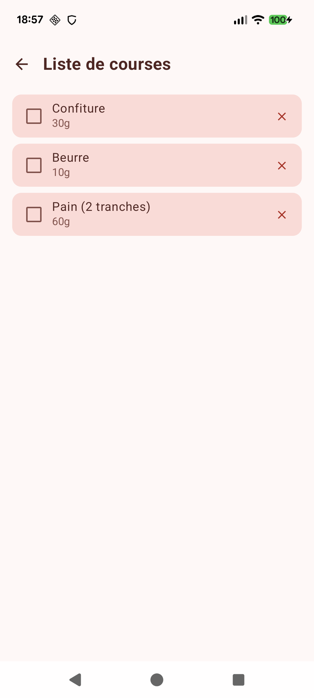
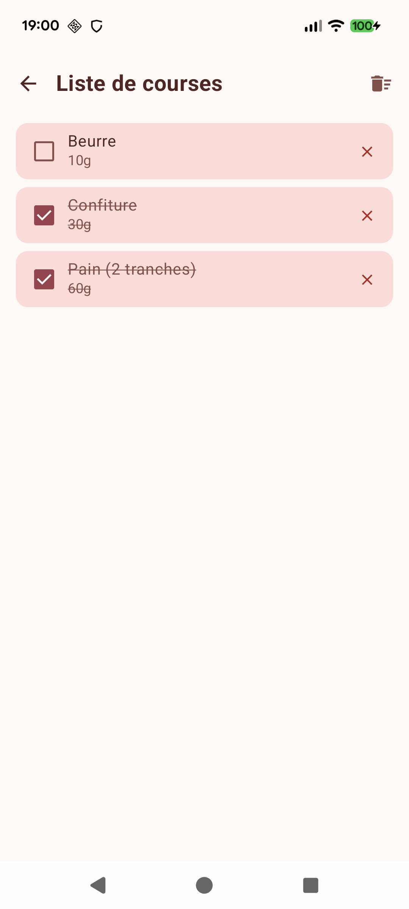

# SnapCal

A free, open-source alternative to [Foodvisor](https://www.foodvisor.io/). Take a photo of your meal and instantly get a detailed breakdown of ingredients, quantities, macronutrients, and calorie count — powered by Google's Gemini AI.

## Screenshots

<p align="center">
  
  
  
  
  
  
  
  
  
  
</p>

## Features

- **Snap or pick**: Take a photo with your camera or choose one from your gallery
- **AI-powered analysis**: Uses Gemini 2.0 Flash to identify ingredients and estimate nutritional values
- **Text & voice input**: Describe what you ate by typing or using voice recognition
- **Barcode scanning**: Scan product barcodes to get nutrition info from Open Food Facts
- **Dashboard**: Track daily calories and macronutrients with a visual progress ring
- **Meal history & trends**: View past meals and nutrition trends over 1 week, 1 month, 3 months or 1 year
- **Meal merge**: Long-press to select multiple meals and combine them into one
- **Favorites**: Star your frequent meals and re-add them with one tap
- **Daily notes**: Add a daily comment on your dashboard (e.g. "family dinner", "stressful day") — one note per day, editable
- **Nutritional goals**: Set manual calorie goals or let AI compute personalized targets based on your profile
- **Home screen widget**: Glanceable calories widget showing consumed / goal with a progress bar
- **Shopping list**: Add meal ingredients to a persistent shopping list — check off, delete or clear items as you shop (opt-in via Profile)
- **Meal reminders**: Configurable notifications for breakfast (08:00), lunch (12:30) and dinner (20:30) with adjustable times
- **Health Connect**: Sync weight data and burned calories from Google Health Connect
- **Google Drive backup**: Back up and restore all your data (meals, profile, weight history, daily notes)
- **Multilingual**: Supports English and French (adapts to your device language)
- **No account required**: Just bring your own Gemini API key — no sign-up, no subscription, no tracking
- **AI correction**: Not happy with the analysis? Describe what's different and let AI correct it

## Architecture

Built with **Clean Architecture** principles:

```
domain/          Models, repository interfaces, use cases (no Android dependencies)
data/            Gemini REST API client, Room database, repository implementations
presentation/    Jetpack Compose UI, ViewModel, Material 3 theme, navigation
```

**Tech stack**: Kotlin, Jetpack Compose, Material 3, Room, CameraX contracts, Coil, WorkManager, Gemini REST API.

## Getting Started

### Prerequisites

- **JDK 21+**
- **Android SDK** (`ANDROID_HOME` must be set, or SDK installed at `~/Library/Android/sdk`)
- A **Google Gemini API key** — get one free at [Google AI Studio](https://aistudio.google.com/apikey)

### Setup

1. Clone the repository:
   ```bash
   git clone https://github.com/ghostwan/food-calories.git
   cd food-calories
   ```

2. Add your Gemini API key to `local.properties`:
   ```properties
   GEMINI_API_KEY=your_api_key_here
   ```

3. Build and run (no Android Studio needed):
   ```bash
   ./build.sh build     # Build the debug APK
   ./build.sh install   # Build + install on connected device
   ./build.sh run       # Build + install + launch
   ./build.sh clean     # Clean build artifacts
   ./gradlew assembleRelease  # Build release APK
   ```

The build script automatically downloads Gradle if needed and generates the wrapper.

## Why?

Apps like Foodvisor charge a subscription for food photo analysis. This project provides the same core functionality for free using the Gemini API generous free tier. Your data stays between you and the Gemini API — no intermediary server, no account, no analytics.

## License

MIT
